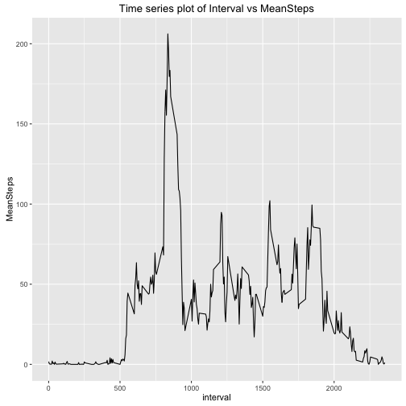

## Setting the working directory and loading the required packages


```r
library(dplyr)
library(ggplot2)
library(lubridate)
library(mice)
library(plotly)

setwd("/Users/vinaysesham/Documents/datasciencecoursera/ReproducibleResearch/RepData_PeerAssessment1")
```

## Loading and preprocessing the data


```r
rawData <- read.csv("activity.csv",header=TRUE, sep=",")

### After examining the classes of variabels using sapply(rawData, class), we found that date is of factor class. date needs to be converted to Date class. using the dplyr mutate and lubridate as.Date functions to convert date to Date class

rawData <- mutate(rawData, date = as.Date(date))
```

## What is mean total number of steps taken per day?

```r
### calculating TotalSteps by grouping data by date and then using summarize function to derive totals
TotalSteps <- group_by(rawData, date) %>% 
              summarize(StepsPerDay = sum(steps)) %>%
              mutate(DateRecorded = as.Date(date)) %>%
              select(-(date))

### plotting using plot function, type="h" denoted histogram
with(TotalSteps,plot(DateRecorded,StepsPerDay,type="h",lwd=5,col="green")) 
title(main="Histogram - Total Steps Per Day")
```

 

```r
### calculating mean and median steps
MeanSteps <- mean(TotalSteps$StepsPerDay,na.rm=TRUE) ### Calculating mean of StepsPerDay
MeanSteps
```

```
## [1] 10766.19
```

```r
MedianSteps <- median(TotalSteps$StepsPerDay,na.rm=TRUE) ### Calculating median of StepsPerDay
MedianSteps
```

```
## [1] 10765
```

## What is the average daily activity pattern?


```r
### Creating AverageSteps data frame grouping by interval and mean on steps
AverageSteps <- group_by(rawData, interval) %>% summarize(MeanSteps = mean(steps,na.rm=TRUE))
### using ggplot with interval on x-axis and MeanSteps on y-axis to generate time series plot
ggplot(AverageSteps, aes(interval,MeanSteps)) + geom_line() + ggtitle("Time series plot of Interval vs MeanSteps")
```

 

```r
## Which 5-minute interval, on average across all the days in the dataset, contains the maximum number of steps?

filter(AverageSteps, MeanSteps == max(MeanSteps))
```

```
## Source: local data frame [1 x 2]
## 
##   interval MeanSteps
##      (int)     (dbl)
## 1      835  206.1698
```

## Imputing missing values


```r
## Calculate and report the total number of missing values in the dataset (i.e. the total number of rows with 𝙽𝙰s) 
TotalNA <- sum(is.na(rawData))

TotalNA
```

```
## [1] 2304
```

```r
### Devise a strategy for filling in all of the missing values in the dataset. 
### The strategy does not need to be sophisticated. For example, you could use the mean/median for ### that day, or the mean for that 5-minute interval, etc.

### creating a copy of original dataset
rawDataCopy <- rawData
### identifying the positions of NA's 
pos <- which(is.na(rawDataCopy$steps))
### creating a vector of mean values
mean_vec <- rep(mean(rawDataCopy$steps, na.rm=TRUE), times=length(pos))
### imputing NA values
rawDataCopy[pos, "steps"] <- mean_vec
### grouping by date and calculating totals on steps
AggregateData <- aggregate(rawDataCopy$steps, by=list(rawData$date), FUN=sum)
### renaming columns
names(AggregateData) <- c("DateRecorded", "TotalStepsPerDay")

### Make a histogrm of the total number of steps taken each day after imputing missed data

with(AggregateData,plot(as.Date(DateRecorded),TotalStepsPerDay,type="h",lwd=5,col="green"))
title(main="Histogram - Total Steps Per Day after imputing data")
```

 

```r
### Mean of total steps after imputing data
imputedMeanSteps <- mean(AggregateData$TotalStepsPerDay)

imputedMeanSteps
```

```
## [1] 10766.19
```

```r
### Meadin total number of steps after imputing data
Median_Steps <- median(AggregateData$TotalStepsPerDay)

Median_Steps
```

```
## [1] 10766.19
```

## Are there differences in activity patterns between weekdays and weekends?


```r
### step 1: Creating a factor variable in the dataset with two levels - "weekday" and "weekend"

### convering date column to Date type as mutating the column
completedData <- mutate(rawDataCopy, DateRecorded = as.Date(date)) %>%
                  select(-(date))
### Assigning day names to each date
completedData$Day <- weekdays(completedData$DateRecorded,abbreviate=FALSE) 
### using ifelse condition to identify each day as weekday or weekend
completedData <- transform(completedData,Day = ifelse(Day %in% c('Monday','Tuesday','Wednesday','Thursday','Friday'),'Weekday','Weekend'))

### exploring the output
head(completedData) 
```

```
##     steps interval DateRecorded     Day
## 1 37.3826        0   2012-10-01 Weekday
## 2 37.3826        5   2012-10-01 Weekday
## 3 37.3826       10   2012-10-01 Weekday
## 4 37.3826       15   2012-10-01 Weekday
## 5 37.3826       20   2012-10-01 Weekday
## 6 37.3826       25   2012-10-01 Weekday
```

```r
### Make a panel plot containing a time series plot of the 5-minute interval(x-axis) and the
### average number of steps taken, averaged across all weekday days and weekend days.

### creating dataframe MeanSteps - grouped on interval, Day and calculating mean of steps
MeanSteps<-aggregate(steps~interval+Day, completedData,mean)

### using ggplot to plot the dataframe MeanSteps

ggplot(MeanSteps, aes(interval,steps)) + ggtitle("Time series plot of activity on weekday and weekend") +
  facet_wrap(~Day,ncol=1) + 
  geom_line(color = "steelblue") +
  theme_bw() +
  theme(axis.line = element_line(colour = "black"),
        panel.grid.major = element_blank(),
        panel.grid.minor = element_blank())
```

 

```r
### There appears to be a visible difference in activity patterns on weekdays and weekends. There is increased activity on weekends between interval's 1000 and 1800, where as on weekdays its lesser.
```


